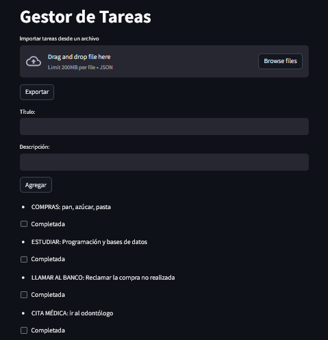
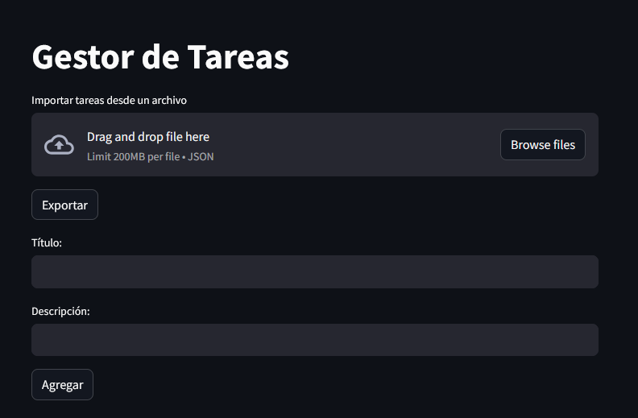
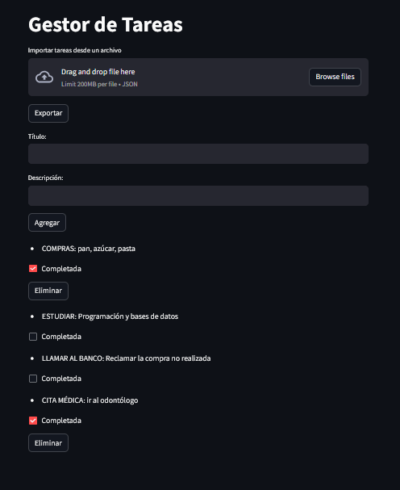
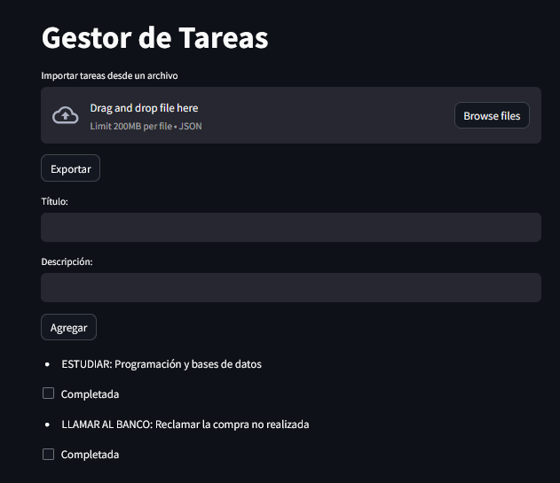

# Task Managment

This repository contains code for creating a simple Task List application using Python and Streamlit. The application allows users to manage their tasks by adding new tasks, marking tasks as completed, and deleting the task. Also 

## Usage

To use the application, you can follow these steps:


1. Clone the repository:
   ```
   git clone <repository_url>
   ```

2. Navigate to the project directory:
   ```
   cd task-managment
   ```

3. Add the environment variable `DATABASE_URL`** to the `.env` file. Here is an example of how it should look:

    ```plaintext
    DATABASE_URL=postgresql://<usuario>:<contraseña>@<host>:<puerto>/<nombre_base_datos>
    ```

5. Install the necessary dependencies by running the following command:
   ```
   pip install -r requirements.txt
   ```

6. Run the application using Streamlit:
   ```
   streamlit run app.py
   ```

5. A web app will open in your browser, displaying the Task List interface.



6. To add a new task, type the task title and description in the input boxs and click the "Agregar" button.



7. To mark a task as completed, click the checkbox below to the task.



8. To delete task, click the "Eliminar" button.



## Repository Files

- `app.py`: This file contains the main code for the application. It uses the Streamlit library for building the user interface 
- `managment.py`: This file handles task management functions.
- `models.py`: Provides the models and data configuration with SQLAlchemy ORM.
